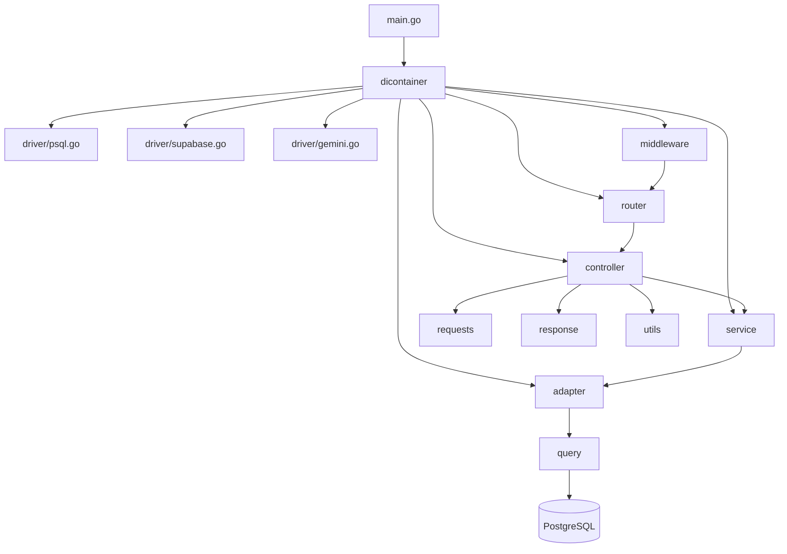

# 01 アーキテクチャ解説

## 採用しているパターン：レイヤードアーキテクチャ

このプロジェクトは **4層のレイヤードアーキテクチャ** を採用しています。

各層には明確な責任があり、**上位層から下位層への一方向の依存** を保ちます。

```
Controller（HTTP の入出力）
    ↓ 呼び出す
Service（ビジネスロジック）
    ↓ 呼び出す
Adapter（DB 操作）
    ↓ 呼び出す
Query（sqlc 生成コード・SQL 実行）
```

> **なぜこの設計か？**
> 各層の責任を分離することで「HTTP の変更がビジネスロジックに影響しない」「DB の変更が Controller に伝播しない」という状態を保ちます。テストも層ごとに独立して書けます。

---

## 各層の責任

### Controller 層
**ファイル**: `controller/*.go`

- HTTP リクエストを受け取る（`ctx.Bind()`）
- バリデーションを実行する（`ctx.Validate()`）
- Service を呼び出す
- HTTP レスポンスを返す（`ctx.JSON()`）
- **HTTP のエラーコード（400/401/404/500）を決める**のはここだけ

```go
// controller/user_controller.go
func (c *UserController) GetMySkills(ctx echo.Context) error {
    // 1. 認証ユーザーIDを取得
    userID, err := parseUserID(ctx)
    if err != nil {
        return ctx.JSON(http.StatusUnauthorized, ...)
    }

    // 2. Service を呼ぶ
    user, skills, err := c.userService.GetMySkills(ctx.Request().Context(), userID)
    if err != nil {
        if errors.Is(err, sql.ErrNoRows) {
            return ctx.JSON(http.StatusNotFound, ...)  // HTTP ステータスを決定
        }
        return ctx.JSON(http.StatusInternalServerError, ...)
    }

    // 3. レスポンス型に変換して返す
    return ctx.JSON(http.StatusOK, buildMySkillsResponse(user, skills))
}
```

---

### Service 層
**ファイル**: `service/*.go`

- **ビジネスルールを実装する**
- 複数の Adapter を組み合わせる
- HTTP や DB の知識を持たない（echo/sql をインポートしない）
- requests パッケージの型を Adapter 向け型に変換する

```go
// service/user_service.go
func (s *UserService) UpsertMySkills(
    ctx context.Context,
    userID uuid.UUID,
    req requests.UpsertSkillsRequest,
) (query.User, []query.UserSkill, error) {
    // requests 型を adapter の型に変換
    skills := make([]adapter.SkillInput, len(req.Skills))
    for i, s := range req.Skills {
        skills[i] = adapter.SkillInput{...}
    }

    // Adapter に委譲
    if err := s.userAdapter.UpsertSkills(ctx, userID, ...); err != nil {
        return query.User{}, nil, err
    }

    // upsert 後の最新データを返す
    return s.userAdapter.GetMySkills(ctx, userID)
}
```

---

### Adapter 層
**ファイル**: `adapter/*.go`

- **DB とのやり取りだけ** に責任を持つ
- sqlc の生成コード（`query.*`）を呼び出す
- **トランザクションはここで管理する**
- Service には「成功/失敗」と「取得したデータ」だけを返す

```go
// adapter/user_adapter.go
func (a *UserAdapter) UpsertSkills(ctx context.Context, userID uuid.UUID, ...) error {
    tx, err := a.db.BeginTx(ctx, nil)
    if err != nil { return err }
    defer tx.Rollback()  // エラー時の安全ネット

    qtx := a.q.WithTx(tx)  // トランザクション付き Queries

    qtx.DeleteUserSkills(ctx, userID)       // 1. 全削除
    for _, s := range skills {
        qtx.CreateUserSkill(ctx, params)    // 2. 再挿入
    }
    qtx.UpdateUserProfile(ctx, params)      // 3. プロフィール更新

    return tx.Commit()
}
```

---

### Query 層
**ファイル**: `query/*.go`（**自動生成・手書き禁止**）

- sqlc が `sql/queries/*.sql` から自動生成
- Go の型安全な SQL 実行関数を提供する
- `WithTx(*sql.Tx)` でトランザクション対応

```go
// query/users.sql.go（自動生成）
func (q *Queries) CreateUserSkill(ctx context.Context, arg CreateUserSkillParams) (UserSkill, error) {
    row := q.db.QueryRowContext(ctx, createUserSkill, arg.UserID, arg.SkillName, ...)
    // ... Scan して UserSkill を返す
}
```

---

## 依存関係図



> **ポイント**: `dicontainer` だけがすべての層を知っています。他の層は隣接する1層だけを知っています。

---

## 依存性注入（DI）の仕組み

`dicontainer/dicontainer.go` がプロジェクトの **配線図** です。

```go
func New() (*Container, error) {
    // Step 1: インフラ層（最下層）を初期化
    db, _ := driver.NewPostgresDB()
    supabaseCfg := driver.NewSupabaseConfig()
    q := query.New(db)

    // Step 2: Adapter 層（DB操作）を初期化
    userAdapter := adapter.NewUserAdapter(q, db)
    teamAdapter := adapter.NewTeamAdapter(q)
    webhookAdapter := adapter.NewWebhookAdapter(db)

    // Step 3: Service 層（ビジネスロジック）を初期化
    userService := service.NewUserService(userAdapter)

    // Step 4: Controller 層（HTTP）を初期化
    userController := controller.NewUserController(userService)

    // Step 5: Echo を設定
    e := echo.New()
    e.Validator = utils.NewValidator()  // バリデータ登録
    e.Use(echoMiddleware.Logger())

    // Step 6: ルート登録
    auth := middleware.NewSupabaseAuth(supabaseCfg.JWTSecret)
    router.RegisterUserRoutes(e, userController, auth)

    return &Container{echo: e}, nil
}
```

> **なぜこの設計か？**
> 各層は「インターフェース（コンストラクタ引数）」で依存を受け取るため、テスト時にモックに差し替えられます。`NewUserAdapter(q, db)` を `NewUserAdapter(mockQ, mockDB)` にするだけでテスト可能です。

---

## 横断的な関心事（Cross-Cutting Concerns）

### 認証ミドルウェア
Echo の `Group` に適用し、ルート単位で認証要否を制御します。

```go
// router/user_router.go
func RegisterUserRoutes(e *echo.Echo, c *controller.UserController, m *middleware.SupabaseAuth) {
    g := e.Group("/users", m.Verify)  // このグループ全体に認証を適用
    g.GET("/me/skills", c.GetMySkills)
    g.PUT("/me/skills", c.UpsertMySkills)
}
```

### バリデーション
`go-playground/validator` を Echo に登録することで、`ctx.Validate()` 1行でタグベースのバリデーションが動きます。

```go
// utils/validator.go
type CustomValidator struct{ v *validator.Validate }
func (cv *CustomValidator) Validate(i interface{}) error { return cv.v.Struct(i) }

// dicontainer.go
e.Validator = utils.NewValidator()

// controller での使用
ctx.Bind(&req)    // JSON → 構造体
ctx.Validate(&req) // タグ検証（required, max=30 など）
```

### エラーハンドリング
`utils/error_util.go` に共通エラーレスポンス関数があります。

```go
// utils/error_util.go
type ErrorResponse struct {
    Code    int    `json:"code"`
    Message string `json:"message"`
}

func InternalServerError(c echo.Context, msg string) error {
    return c.JSON(http.StatusInternalServerError, ErrorResponse{500, msg})
}
```
