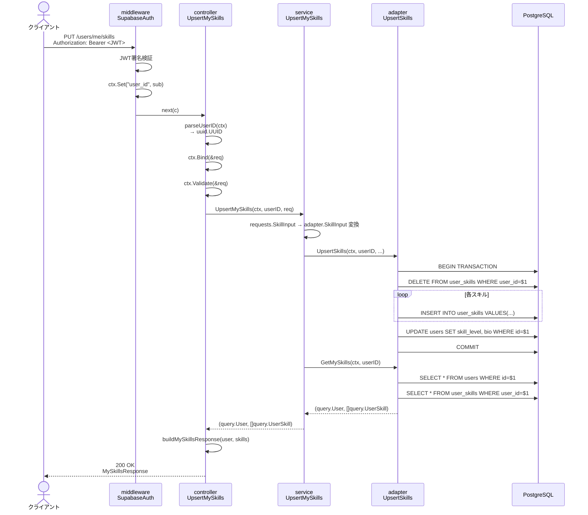

# 02 データフロー解説

## スキル登録の完全なデータフロー

`PUT /users/me/skills` を例に、リクエストが DB に保存されるまでの全工程を追います。

---

## シーケンス図



---

## 各ステップの詳細

### Step 1: JWT 認証（Middleware）

```go
// middleware/supabase_auth.go

// Authorization ヘッダーから Bearer トークンを取り出す
token := strings.TrimPrefix(authHeader, "Bearer ")

// Supabase の JWT_SECRET で署名検証
parsed, err := jwt.ParseWithClaims(token, claims, func(t *jwt.Token) (interface{}, error) {
    return []byte(m.jwtSecret), nil
})

// 検証成功 → user_id（= Supabase の sub クレーム）をコンテキストに保存
c.Set("user_id", claims["sub"])
```

> **ポイント**: `claims["sub"]` は Supabase が発行した UUID 文字列です。これが後続のすべての処理で「誰のリクエストか」を識別するキーになります。

---

### Step 2: Controller でのリクエスト処理

```go
// controller/user_controller.go

// user_id を uuid.UUID 型に変換
func parseUserID(ctx echo.Context) (uuid.UUID, error) {
    raw := ctx.Get("user_id")       // middleware がセットした値
    str, ok := raw.(string)         // interface{} → string へキャスト
    if !ok {
        return uuid.UUID{}, echo.ErrUnauthorized
    }
    return uuid.Parse(str)          // string → uuid.UUID へパース
}

// JSON → 構造体 へバインド
var req requests.UpsertSkillsRequest
ctx.Bind(&req)

// バリデーション実行（validate タグを評価）
ctx.Validate(&req)
// 例: skill_level が "expert" なら → 400 Bad Request
```

---

### Step 3: Service での型変換

```go
// service/user_service.go

// requests パッケージの型を adapter 向け型に変換
skills := make([]adapter.SkillInput, len(req.Skills))
for i, s := range req.Skills {
    skills[i] = adapter.SkillInput{
        SkillName:       s.SkillName,
        ExperienceYears: s.ExperienceYears,  // *float64
        IsLearningGoal:  s.IsLearningGoal,
    }
}
```

> **なぜ変換するのか？**: Controller と Adapter が直接 requests パッケージに依存すると、HTTP の変更（フィールド名変更など）が DB 操作コードに波及します。Service がバッファになることで変更の影響範囲を最小化します。

---

### Step 4: Adapter でのトランザクション実行

```go
// adapter/user_adapter.go

tx, err := a.db.BeginTx(ctx, nil)
defer tx.Rollback()  // ← どのパスでも必ずロールバック可能にする安全ネット

qtx := a.q.WithTx(tx)  // トランザクション付き sqlc Queries

// 1. 既存スキルを全削除（全置換方式）
qtx.DeleteUserSkills(ctx, userID)

// 2. 新スキルを順番に挿入
for _, s := range skills {
    var expYears sql.NullString
    if s.ExperienceYears != nil {
        // float64 → string に変換（DB型 DECIMAL → sqlc が NullString に変換）
        expYears = sql.NullString{
            String: strconv.FormatFloat(*s.ExperienceYears, 'f', 1, 64),
            Valid:  true,
        }
    }
    qtx.CreateUserSkill(ctx, query.CreateUserSkillParams{...})
}

// 3. users テーブルのプロフィールも更新
qtx.UpdateUserProfile(ctx, query.UpdateUserProfileParams{
    ID:         userID,
    SkillLevel: skillLevel,
    Bio:        sql.NullString{String: bio, Valid: bio != ""},
})

return tx.Commit()  // ← 全成功したら確定。失敗なら defer の Rollback が動く
```

---

### Step 5: upsert 後のデータ返却

```go
// service/user_service.go（UpsertMySkills の末尾）

// adapter.UpsertSkills が成功したら、最新データを取得して返す
return s.userAdapter.GetMySkills(ctx, userID)
// → Controller が受け取り、buildMySkillsResponse() でレスポンス型に変換
```

---

## Webhook フロー（Supabase ユーザー作成時）

Supabase でユーザーが作成されると自動的にこのフローが走ります。

```
Supabase Auth
    │ POST /webhooks/supabase/user-created
    │ Body: { "type": "INSERT", "table": "users", "record": { "id": "uuid" } }
    ▼
webhook_controller.OnUserCreated()
    │ type == "INSERT" && table == "users" を確認
    │
    ▼
webhook_adapter.AssignLoginUserRole(ctx, userID)
    │
    ▼
INSERT INTO user_global_roles (user_id, global_role_id)
VALUES ($1, 2)  -- 2 = LOGIN_USER
ON CONFLICT DO NOTHING
```

> **なぜこれが必要か？**: Supabase の認証ユーザーと、アプリ独自の RBAC（ロール管理）を紐付けるためです。ユーザーが初めてサインアップした瞬間に `LOGIN_USER` ロールを自動付与します。

---

## 認証ありルートと認証なしルートの違い

```go
// 認証なし（誰でも呼べる）
e.GET("/skills", c.ListSkillTags)
e.GET("/health", ...)

// 認証あり（グループにミドルウェアを適用）
g := e.Group("/users", m.Verify)  // ← ここで全ルートに認証を義務付け
g.GET("/me/skills", c.GetMySkills)
g.PUT("/me/skills", c.UpsertMySkills)
```

---

## データの型変換マップ

`ExperienceYears` を例に、型がレイヤーをまたぐたびに変換される様子を示します。

```
クライアント JSON     Service/Request    Adapter         DB
─────────────────────────────────────────────────────────────
"experience_years": 2.5
        ↓ ctx.Bind()
     *float64(2.5)
        ↓ adapter.SkillInput
     *float64(2.5)
        ↓ strconv.FormatFloat(..., 'f', 1, 64)
     sql.NullString("2.5", Valid: true)
        ↓ SQL INSERT
     DECIMAL(3,1) → 2.5
        ↓ sqlc Scan
     sql.NullString("2.5", Valid: true)
        ↓ strconv.ParseFloat
     *float64(2.5)
        ↓ ctx.JSON()
"experience_years": 2.5
```

> **なぜこんなに変換が多いのか？**: PostgreSQL の `DECIMAL` 型を sqlc がデフォルトで `sql.NullString` にマッピングするためです。型オーバーライドを設定すれば削減できます。
