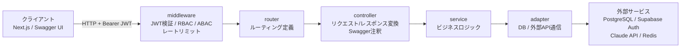
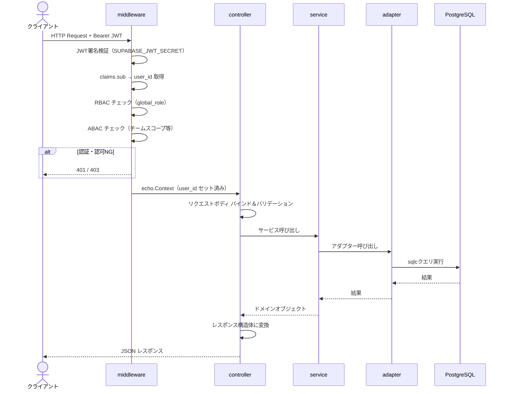
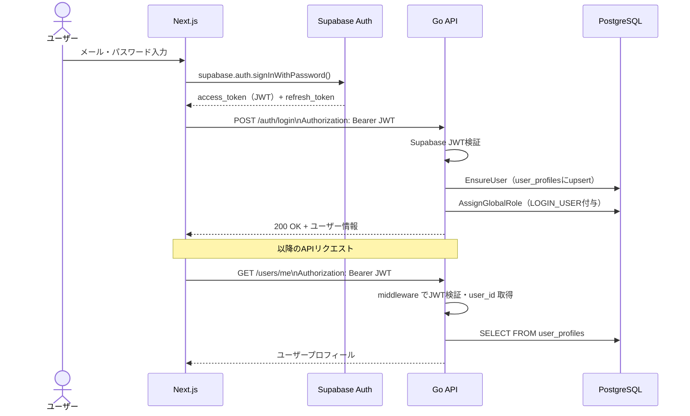
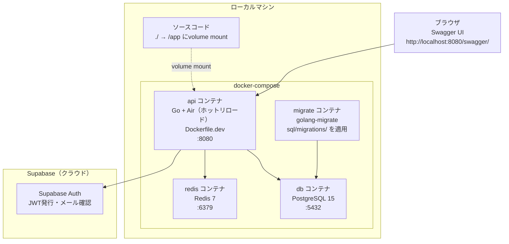
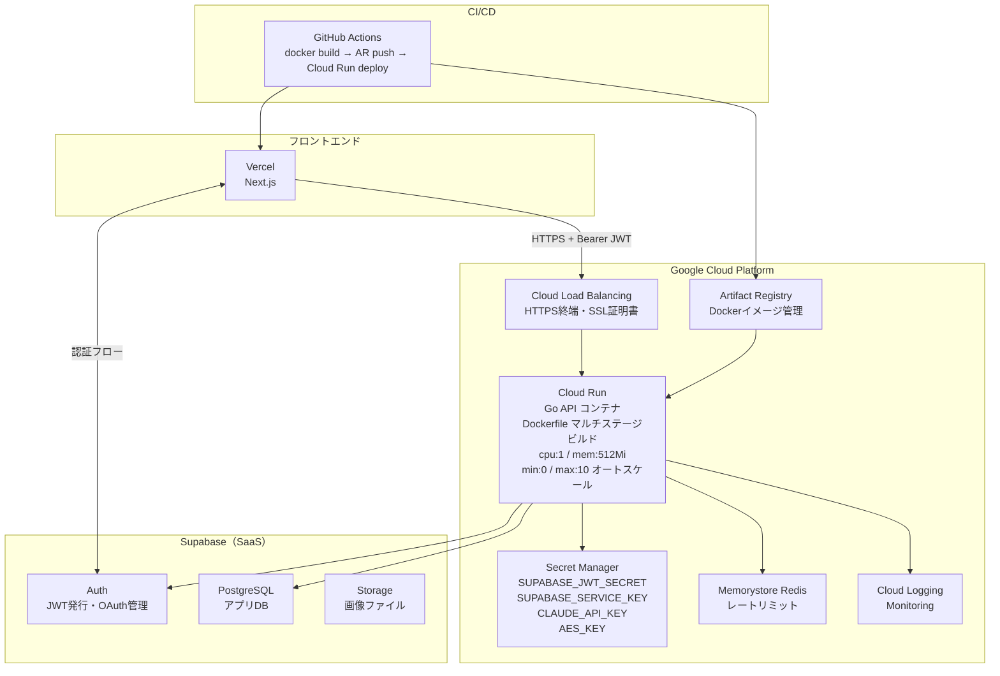
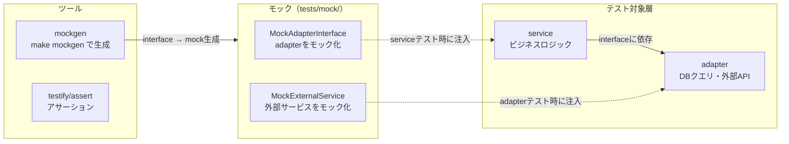

# APIアーキテクチャ設計書

> 参照元：`tech-stack-v3.md` / `db-design.md` / `permission-design-v6.md`

---

## 1. 層状アーキテクチャ（共通）



### 各層の責務

| 層 | ディレクトリ | 責務 |
|----|------------|------|
| middleware | `middleware/` | JWT検証・RBAC/ABACチェック・レートリミット |
| router | `router/` | エンドポイントとcontrollerのマッピング |
| controller | `controller/` | リクエスト/レスポンス変換・Swagger注釈・エラーハンドリング |
| service | `service/` | ビジネスロジック・バリデーション |
| adapter | `adapter/` | DB・外部APIとの通信（sqlcクエリの呼び出し） |
| query | `query/` | sqlcが自動生成した型安全なDBクエリ |

---

## 2. リクエスト処理の詳細フロー



---

## 3. 認証フロー（Supabase連携）



---

## 4. 開発環境

### 構成図



### 起動方法

```bash
# コンテナ起動（migrate も自動実行）
docker compose up

# マイグレーションのみ再実行
docker compose run --rm migrate

# sqlcコード再生成
make sqlc

# Swagger docs再生成
swag init -g main.go
```

### 開発環境の特徴

| 項目 | 内容 |
|------|------|
| ホットリロード | Air（`.air.toml`）でソース変更を即反映 |
| DB | ローカルPostgreSQL（`roadmap_dev`） |
| マイグレーション | `sql/migrations/` を golang-migrate で管理 |
| Supabase Auth | 本番Supabaseに接続（JWT検証はクラウドへ） |
| Swagger UI | `http://localhost:8080/swagger/` で有効 |
| 環境変数 | `.env.local` から読み込み |

### ディレクトリ構成（開発関連）

```
roadmap_api/
├── Dockerfile.dev          # 開発用（Air入り）
├── docker-compose.yml      # ローカル環境一式
├── .env.local              # 開発用環境変数（git管理外）
├── sql/
│   ├── migrations/         # golang-migrate マイグレーションファイル
│   ├── queries/            # sqlc用クエリ定義（*.sql）
│   └── schema.sql          # スキーマ全体
├── query/                  # sqlcが自動生成（編集禁止）
├── supabase/
│   └── migrations/         # Supabase CLIマイグレーション（参考用）
└── docs/                   # swag initで自動生成（編集禁止）
```

---

## 5. 本番環境

### 構成図



### 起動方法（CI/CD）

```bash
# GitHub Actions が mainブランチへのマージで自動実行
# 1. docker build（マルチステージ）
# 2. Artifact Registry へ push
# 3. Cloud Run へ deploy
```

### 本番環境の特徴

| 項目 | 内容 |
|------|------|
| コンテナ | `Dockerfile`（distroless, nonrootユーザー）|
| DB | Supabase PostgreSQL（マネージド） |
| マイグレーション | Supabase CLI / ダッシュボードで管理 |
| シークレット | Google Cloud Secret Manager から注入 |
| Swagger UI | `APP_ENV=production` のとき無効化推奨 |
| スケール | Cloud Run オートスケール（min:0） |
| Redis | Memorystore（またはUpstash無料枠） |

---

## 6. 開発環境 vs 本番環境 比較

| 項目 | 開発環境 | 本番環境 |
|------|----------|----------|
| 起動方法 | `docker compose up` | GitHub Actions（CI/CD） |
| Dockerfile | `Dockerfile.dev`（Air入り） | `Dockerfile`（distroless） |
| DB | ローカルPostgreSQL（Docker） | Supabase PostgreSQL |
| マイグレーション | `sql/migrations/`（golang-migrate） | Supabase CLIまたはダッシュボード |
| Redis | Dockerコンテナ | Memorystore / Upstash |
| 環境変数 | `.env.local` | Cloud Secret Manager |
| Swagger UI | 有効（`/swagger/`） | 無効化推奨 |
| ホットリロード | Air（有効） | なし |
| ログ | 標準出力 | Cloud Logging |
| イメージサイズ | 大（Alpine + Air + devtools） | 小（distroless, ~10MB程度） |

---

## 7. テスト戦略



### テスト実行

```bash
# モック再生成
make mockgen

# テスト実行
go test ./...

# カバレッジ確認
go test ./... -cover
```

### テスト方針

- **controller はテスト対象外**（リクエスト/レスポンス変換のみのため）
- **service** はアダプターをモック化してビジネスロジックを検証
- **adapter** はDBを実際に使った統合テストを推奨（モックとの乖離防止）
